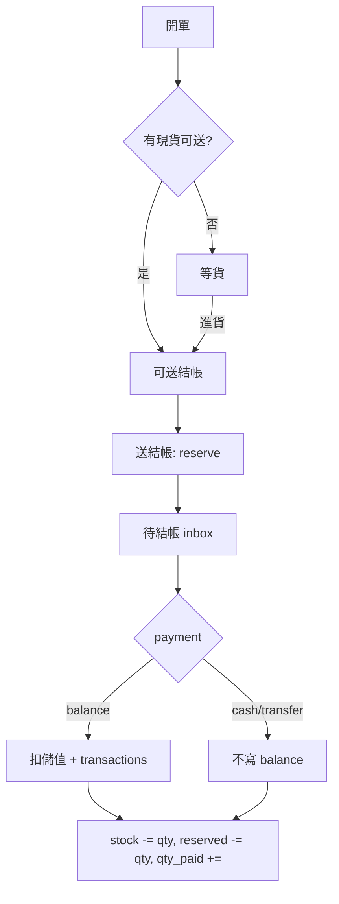

# 內部商品訂單系統規劃

> **定位**：店內用開單／結帳／扣庫存工具。**不**取代公開 `/shop` 型錄（見 `SHOP_PLAN.md`）。
>
> 📅 規劃日期：2026-05-31
> ✅ 狀態：Phase 1–2 核心已上線；Phase 3 LIFF 商品訂單已上線；CSV 報表待做

---

## 0. 與公開商城的關係

| 項目 | 公開 `/shop` | 內部訂單 |
|------|-------------|----------|
| 對象 | 路人、LINE 詢問 | 登入後台店員 |
| 下單 | ❌ LINE 詢問 | ✅ 後台開單 |
| 金流 | ❌ | ✅ 結帳扣款 |
| 庫存 | 只顯示有貨／缺貨 | reserve + 結帳扣 stock |
| LIFF | ❌ | Phase 3 會員查進度 |

**一句話**：型錄讓客人看；訂單讓店員登記與結帳。

---

## 1. 核心流程（對齊預約 + 結帳）

分工類比：

| 預約系統 | 商品訂單 |
|----------|----------|
| 開預約 | 開單（訂單成立） |
| 等條件成熟 | 等貨／可送結帳 |
| 教練回報 | 商品同事 **送結帳** |
| 待扣款（CoachAdmin） | **待結帳** |
| 扣儲值／現金／匯款 | 同上，可 **代扣** |
| 刪除已有交易 → 人工處理帳 | 同上 |

### 1.1 五步程序

```
① 訂單成立（商品同事）
   訂購人、品項、成交價、面交／寄送、備註

② 等貨 or 可送結帳（系統依 stock 提示，不 reserve）
   ├─ **到貨、有現貨** → 該列出現在「可送結帳」（可送數量 ≤ 現有 stock − 已 reserve）
   └─ 還沒現貨 → 「等貨」（預購可拖很久；**不能**送結帳）

③ 送結帳（商品同事）
   確認這批貨可以跟客人收錢了（面交／寄出前後由店內習慣決定）
   → **僅在有現貨時可送**；RPC 檢查 `qty_submit ≤ stock − reserved_qty`
   → 通過後 reserve + 增加 qty_pending_bill

④ 待結帳（**管理員** inbox · 訂單結帳頁）
   儲值／匯款／現金；可指定代扣會員

⑤ 已結帳
   寫 transactions（儲值時）、扣 stock、釋放 reserve、增加 qty_paid
```

**Reserve 時點**：只在 **③ 送結帳**，不在開單時。長預購不占用 `reserved_qty`。

**付款時點**：**取貨／交貨才收款** → 實務上由商品在適當時機按「送結帳」，結帳同事在「待結帳」扣款。

---

## 2. 不做的事（v1）

| 項目 | 原因 |
|------|------|
| ❌ 客人線上下單／結帳 | 公開型錄走 LINE |
| ❌ 自動退儲值 | 跟現行金流：作廢後人工到會員交易處理 |
| ❌ 訂單多人會員 | 只選一位會員或手動姓名 |
| ❌ 混合付款拆多筆 | v1 單一 payment_method 一次結清本批 |
| ❌ LINE push 通知 | Messaging API 未通 |
| ❌ 物流 API／發票／金流閘道 | 超出範圍 |
| ❌ 訂單來源統計（型錄轉換） | v2 |
| ❌ 銷售報表 CSV 匯出 | Phase 2 待做（已結帳統計 Tab 已上線；不急） |
| ~~❌ LIFF 訂單查詢~~ | ~~Phase 3~~ → **已上線**（見 §11.4） |

---

## 3. 訂單與品項資料

### 3.1 `shop_orders`

| 欄位 | 說明 |
|------|------|
| `id` | UUID |
| `order_no` | 內部編號，如 `SO-260531-03`（列表／對帳用；客人多半念品名） |
| `member_id` | 可 NULL（非會員僅 `contact_name`） |
| `contact_name` | 訂購人顯示名（會員暱稱或手動輸入） |
| `delivery_method` | `pickup_es` \| `shipping` |
| `shipping_info` | 地址、宅配單號等（可空） |
| `customer_note` | 給客人看（LIFF 後用；例：預計 8 月到貨） |
| `internal_notes` | 店內用 |
| `cancelled_at` | 作廢時間（NULL = 有效） |
| `created_at` / `created_by` | 開單 |
| `updated_at` / `updated_by` | |

### 3.1b `shop_order_settlements`（結帳紀錄 · v1 就要）

每次管理員在「訂單結帳」結清一批，寫一筆（**含匯款／現金**，供 Phase 2 報表；**不**強制寫入 `transactions`）。

| 欄位 | 說明 |
|------|------|
| `id` | UUID |
| `order_id` | FK |
| `payment_method` | `balance` \| `transfer` \| `cash` |
| `charge_member_id` | 扣儲值／代扣對象（現金匯款可 NULL） |
| `amount_total` | 本批結帳總額（帳務端可調後寫入） |
| `settled_by` | 操作者 |
| `settled_at` | 結帳時間 |
| `notes` | 可空 |
| `items_snapshot` | JSONB：本批 `{ item_id, variant_id, qty, unit_price, line_total }`（結帳當下帳務認定數字） |

儲值扣款仍另寫 `transactions`（`shop_order_id`）；匯款／現金以 `shop_order_settlements` 為準。

**帳務調整後**若與已扣 `transactions.amount` 不一致 → **不**自動沖帳；管理員到會員交易人工處理（與作廢策略一致）。

### 3.2 `shop_order_items`

| 欄位 | 說明 |
|------|------|
| `order_id` | FK |
| `variant_id` | FK → `product_variants` |
| `unit_price` | 開單時成交單價快照（商品端可改，**送結帳後鎖**） |
| `qty` | 訂購總數（**送結帳後鎖**；未送部分商品端仍可改） |
| `qty_pending_bill` | 已送結帳、待扣款（已 reserve） |
| `qty_paid` | 已結帳數量 |

**可送結帳數量**（前端計算，須 **到貨有現貨**）：

```text
qty_billable = min(
  qty - qty_pending_bill - qty_paid,   # 尚未送出的訂量
  stock - reserved_qty                  # 現場可售（不含預購未到貨部分）
)
```

`qty_billable = 0` → 該列留在「等貨」。送結帳 RPC 以同一公式檢查，不足則拒絕。

**部分結帳範例**：訂 3 → 到 1 → 送結帳 1 → 結帳 1 → 再到 2 → 送結帳 2 → 結帳 2。

### 3.3 `product_variants` 新增

| 欄位 | 說明 |
|------|------|
| `reserved_qty` | 已送結帳尚未結帳的保留量 |

```text
實際可售 ≈ stock - reserved_qty
```

### 3.4 `transactions` 擴充

| 欄位 | 說明 |
|------|------|
| `shop_order_id` | UUID FK → `shop_orders`，`ON DELETE SET NULL` |

儲值扣款：`transaction_type = consume`，`category = balance`，`description` 含訂單號與品項摘要。

---

## 4. 三個 Inbox（UI 視角）

| Inbox | 誰 | 篩選邏輯 |
|-------|-----|----------|
| **等貨** | 商品 | 有列 `(qty - qty_pending_bill - qty_paid) > 0` 且可送結帳量 = 0 |
| **可送結帳** | 商品 | 有列可送結帳量 > 0 |
| **待結帳** | 管理員（訂單結帳） | 有列 `qty_pending_bill > 0`（或 join 待結批次） |

另：**全部訂單** 列表（搜尋、訂單號、訂購人）。

---

## 5. RPC（原子操作）

### 5.1 `submit_shop_order_billing(p_order_id, p_items jsonb, p_operator_id)`

- `p_items`: `[{ "item_id": "...", "qty": 2 }, ...]`
- 每列：`qty_submit ≤ qty - qty_pending_bill - qty_paid`
- 每列：`qty_submit ≤ stock - reserved_qty`（variant 層級 `FOR UPDATE`）
- 更新：`qty_pending_bill += qty_submit`，`reserved_qty += qty_submit`

### 5.2 `settle_shop_order(p_order_id, p_items jsonb, p_charge_member_id, p_payment_method, p_operator_id)`

- `p_items`: `[{ "item_id", "qty", "unit_price", "line_total" }, ...]` — **帳務端可調**單價／折扣後的金額（品項 `variant_id` 不可改）
- 只結 `qty_pending_bill` 中指定數量（v1 整批結清該次 pending）
- `balance`：依 `p_items` 加總後扣款，寫 `shop_order_id`
- **餘額不足**：**不擋**（與回報管理結帳相同，允許扣成負餘額）
- `cash` / `transfer`：不寫 `transactions`，寫 `shop_order_settlements` + `items_snapshot`
- 每批結帳：插入 `shop_order_settlements`；品項 `stock -= qty_settle`，`reserved_qty -= qty_settle`，`qty_pending_bill -= qty_settle`，`qty_paid += qty_settle`
- **Idempotent**：同一批不可重複結帳（pending 歸零檢查）

### 5.2b `adjust_shop_order_settlement(...)`（v1 可選；至少 UI 要能改 settlement 紀錄）

- **僅 `isAdmin`**；**不可**改 `variant_id`、訂單 `qty`、庫存
- 可改：`shop_order_settlements.amount_total`、`items_snapshot` 內單價／折扣／line_total、`notes`
- 已扣儲值 **不**自動重算；差額走人工會員交易

### 5.3 `cancel_shop_order_billing(p_order_id, p_items jsonb, p_operator_id)`

- **誰能叫**：`can_products`（商品同事；管理員當然可以）
- 撤回尚未結帳的送結帳：`qty_pending_bill` 減少、`reserved_qty` 釋放
- 管理員尚未扣款前，商品端可修正誤送

### 5.4 作廢訂單

- 若 `qty_pending_bill > 0`：先釋放 reserve
- 若已有 `transactions`  linked：前端 **警告** → 刪除／作廢訂單本體 → transactions 保留、`shop_order_id` SET NULL → 提示到會員金流人工處理
- **不**自動退儲值

---

## 6. 刪除、作廢與鎖定規則

### 6.1 誰能改什麼（**送結帳 = 商品確定**）

| 欄位／動作 | 開單～送結帳前（商品 Tab） | 待結帳（訂單結帳） | 已結帳後 |
|------------|---------------------------|-------------------|----------|
| 品項 SKU、加減列 | ✅ 商品同事 | ❌ | ❌ |
| 訂購 `qty`（整列） | ✅（未送出的部分） | ❌ 已 pending 部分 | ❌ |
| `unit_price` | ✅ 商品同事 | ✅ **管理員可調**（折扣／改價） | ✅ **管理員可調帳務紀錄** |
| 本批結帳金額 | — | ✅ 管理員（比照 `PendingDeductionItem`） | ✅ 管理員改 `settlements` |
| 送結帳／撤回 | ✅ 商品 | ❌ | ❌ |
| 扣款／付款方式 | — | ✅ 管理員 | 調帳不重跑自動扣款 |

**一句話**：**商品定品項與數量；帳務定價格與折扣**（待結帳與結帳後皆可調數字，但不動 SKU／庫存）。

### 6.2 作廢

| 狀態 | 行為 |
|------|------|
| 僅開單、未送結帳 | 可直接作廢／刪除 |
| 已送結帳、未結帳 | 先 `cancel_shop_order_billing` 釋放 reserve，再作廢 |
| 已有扣款 transactions | ⚠️ 確認框（比照 `CoachReport` 刪回報）→ 作廢訂單 → **交易保留**，人工調帳 |

已結帳後 **不可改品項**；金額調整走 §6.1 帳務端，不作廢整單除非特殊情況。

---

## 7. 訂購人與代扣

- **一位會員** 或 **手動姓名**（不做預約那種多人 `MemberSelector`）
- UI 可簡化版 picker：搜尋會員 + 非會員姓名輸入
- **代扣**：結帳時選 `charge_member_id`（預設 `order.member_id`）；非會員訂單只能用匯款／現金，或指定代扣會員

---

## 8. 交貨方式

| `delivery_method` | 用途 |
|-------------------|------|
| `pickup_es` | ES 面交 |
| `shipping` | 寄送，`shipping_info` 填地址／單號 |

不用複雜物流狀態機；長預購進度靠 `customer_note` + LIFF（後做）。

---

## 9. 權限

| 入口 | 能力 | 誰能進 |
|------|------|--------|
| 商品管理 › Tab **訂單** | 開單、改單（未結清前）、送結帳、等貨／可送結帳 | `can_products`（超級管理員當然可以） |
| **訂單結帳** | 待結帳 inbox、扣款、代扣 | **`isAdmin`  only**（不新增 DB 權限欄） |

- **不**新增 `can_settle_orders`：結帳一律由管理員處理，跟會員管理／會員儲值同一層。
- 商品頁只使用 `can_products`，不再提供獨立的唯讀商品權限。

---

## 10. 實作位置（定案）

### 10.1 兩個入口、同一套 `shop_orders`

```
BAO › 營運管理 › 商品管理
  ├─ Tab「庫存」     ← 現有 ProductManagement
  └─ Tab「訂單」     ← 開單、等貨、可送結帳、全部訂單

BAO › 會員相關 › 訂單結帳     ← 新增 icon
  └─ 待結帳、扣款、代扣（含非會員匯款／現金）
```

| 路由 | 頁面標題 | 權限 |
|------|----------|------|
| `/products` | 商品管理 · 商品與庫存（預設） | `can_products` 或超管（`isAdmin`） |
| `/products/orders` | 商品管理 · **訂單開單** | `can_products` 或超管（`isAdmin`） |
| `/order-settle` | **訂單結帳**（待結帳 Tab） | `isAdmin` |
| `/order-settle` · 已結帳統計 Tab | 總表＋細帳（`shop_order_settlements`） | `isAdmin` |

**導覽修改**：

- `BaoHub.tsx` › 會員相關：`訂單結帳` → `/order-settle`（整頁 BAO 僅超管可進，無卡片級 `adminOnly`）
- `ProductHub.tsx`（新）：包一層頂 Tab「庫存 \| 訂單」，內嵌既有 `ProductManagement` + `OrderManagement`
- **不**在首頁另加圖示；管理員從 BAO 進（BAO 本身已 `isAdmin`）

**為什麼訂單 Tab 在商品管理、結帳在會員相關？**

- 商品同事：SKU 與開單同一上下文
- 管理員結帳：跟 **會員儲值** 同區，管錢的習慣一致
- 跟「預約表 vs 回報管理（CoachAdmin）」同型，只是商品結帳放在會員區而非預約區

### 10.2 目錄結構

```
src/pages/admin/products/
  ProductHub.tsx           # 路由 /products/*，Tab：庫存 | 訂單
  ProductManagement.tsx    # 庫存（現有，略改）
  api.ts / schema.ts       # 沿用

src/pages/admin/orders/
  OrderManagement.tsx      # Tab「訂單」主頁（等貨 | 可送結帳 | 全部）
  OrderEditDialog.tsx      # 開單／編輯
  OrderDetailPanel.tsx     # 送結帳、作廢
  OrderSettlePage.tsx      # /order-settle · 待結帳 | 已結帳統計
  ShopSettlementStatisticsTab.tsx  # 結帳統計（對標 CoachAdmin StatisticsTab）
  PendingOrderSettleItem.tsx  # 對標 PendingDeductionItem
  OrderMemberPicker.tsx    # 單一會員 + 手動名
  api.ts
  types.ts
```

**共用**：

- 扣款 UI：`PendingDeductionItem.tsx`、`DEDUCTION_FLOW.md`
- 版型：`CoachAdmin.tsx`（待結帳列表）

**不修改**：

- `src/pages/shop/*` 公開型錄

### 10.3 資料庫

```
migrations/121_shop_orders.sql
migrations/122–126（RPC 權限、void、刪除還庫存等）
  - shop_orders, shop_order_items, shop_order_settlements
  - product_variants.reserved_qty
  - transactions.shop_order_id + FK SET NULL
  - RPC: submit / settle / cancel_billing / void_shop_order
  - （不新增 editor_users 欄位）
```

編號接在 `120_variant_cover_image.sql` 之後。

### 10.4 LIFF（Phase 3）

```
src/pages/liff/
  types.ts                 # + ShopOrder 型別
  components/OrdersList.tsx
  LiffMyBookings.tsx       # Tab「商品訂單」
```

- 查詢：`shop_orders.member_id = 綁定會員` 且未作廢
- 顯示：`customer_note`、品項、qty／已送結帳／已付、delivery 白話
- RLS：anon SELECT + 前端只查自己的 `member_id`（比照 transactions）

---

## 11. 開發階段

### Phase 1.5 — UX 強化（2026-05-31 後續 · 已上線）

**訂單列表（商品同事 · 手機優先）**

- [x] 預設「全部」列表；頂部統計列可點篩選（等貨／可送／待結…）
- [x] 搜尋擴充（訂單號、姓名、品牌、品名、貨號、規格）
- [x] 卡片以 **訂購人** 為主、品項 chip（已付／待結／等貨／可送）
- [x] 單一主狀態 badge（含 **部分待結**）
- [x] 送結帳確認含品項摘要；成功 toast「已通知結帳」
- [x] 送結帳／作廢後回到「全部」；統計頁 order_no 可連回列表

**庫存 ↔ 開單**

- [x] 庫存列表／表格／**Gallery** 每 SKU **「開單」** → `/products/orders?newVariant=…` 預填品項

**安全**

- [x] 作廢：已有結清或儲值交易時，需 **再輸入訂單號** 才執行

**術語（商品端）**

- 送結帳 = **通知結帳**（不教管理員去哪扣款）

**Git 參考**：`8bccbf4` → `d502ffa`（main）

### Phase 1 — MVP（先上線店內流程）

- [x] migration 121–126
- [x] `ProductHub` + `/products/orders` 開單、列表、等貨／可送結帳／待結帳／已結清／已作廢
- [x] 送結帳 RPC + reserve
- [x] `/order-settle` 待結帳 + 扣款（`isAdmin`；儲值／匯款／現金、代扣）
- [x] `BaoHub` 會員相關「訂單結帳」入口
- [x] 作廢（`void_shop_order`）+ 已有交易提示

### Phase 2 — 營運加強

- [x] 已結帳統計（`/order-settle` Tab · `fetchSettlementsInRange` · 對標回報統計報表）
- [ ] 匯出 CSV（不急）
- [ ] （可選）訂單號每日流水強化、與 Dashboard 整合

### Phase 3 — 會員 LIFF

- [x] Tab「商品」：查 `member_id` 訂單、品項進度、`customer_note`、面交／寄送（`128_liff_shop_orders_read.sql` + `ShopOrdersList`）
- [ ] `customer_note` 編輯捷徑（商品同事後台）

### Phase 4 — 可選

- [ ] 訂單來源（LINE 詢問／現場）
- [ ] 型錄連結一鍵帶入品項

### 11.2 待做（優先建議）

| 優先 | 項目 | 說明 | 現況 |
|------|------|------|------|
| ~~P1~~ | ~~部分送結帳 UI~~ | ~~手動選 qty~~ | 不需要；有貨一次全送 |
| ~~P1~~ | ~~入庫 → 可送提示~~ | 訂單卡「今日入庫 · 可送結帳」 | ✅ `itemStockInBillableHint` |
| P2 | 匯出 CSV | Phase 2 | 統計 Tab 已有，不急 |
| ~~P2~~ | ~~Gallery 開單~~ | | ✅ |
| ~~P3~~ | ~~LIFF 商品訂單~~ | Phase 3 | ✅ |
| P3 | 訂單號流水／Dashboard | Phase 2 可選 | — |

### 11.4 結帳與列表（2026-06 批次 · 已上線）

- [x] **127** 扣儲值：每品項一筆 `transactions` + 可編輯 `description`
- [x] 結帳 UI 對齊 `PendingDeductionItem`（代扣橘框、切換會員彈窗、確認扣款）
- [x] 代扣：`billing_relations` 依 `contact_name` 自動帶入 +「✓ 自動帶入」
- [x] 訂單列表減雜（`itemQtyChipsForCard`、無左色條）
- [x] 貨號搜尋：`#ABC` 與 `ABC` 皆可（`productSearchHaystack`）
- [x] LIFF「商品」Tab（`liffShopOrders.ts`、`ShopOrdersList`）

**Git 參考**：`8c4a818` 結帳流程 · `ca6e15d` 課程 UI · `bcc8a25` 折數 UX · （本批）LIFF + 入庫提示 + 代扣自動帶入

### 11.3 流程是否順暢？

**已順的部分（實務主路徑）**

```
開單 → 等貨 → 有現貨按「送結帳」→ 管理員待結帳扣款 → 已結清
```

- **部分到貨**：同一張訂單可分批送；已結清的不會重複送（`qty_open` 扣掉已通知／已付）
- **庫存開單**：入庫後從 SKU 一鍵開單，少抄品名
- **手機**：列表、開單 Dialog、統計篩選已針對商品同事調整

**情境 A／B（同一單、不拆單、不重複送）**

| 情境 | 行為 | 測試 |
|------|------|------|
| **A** 多品項，部分有貨 | 有貨的一次全送；等貨品項略過；B 到貨後第二輪只送 B | `orderUtils.billing.test.ts` Scenario A |
| **B** 同品項分批到貨 | 到 1 送 1 結 1 → 再到 2 送 2 結 2；已待結／已結清不重送 | 同上 Scenario B |
| 防重複 | `qtyBillable = min(open, stock−reserve)`；payload 空則隱藏按鈕；RPC 再擋 | 同上 + `orderCanSubmitBilling` |

**已知限制（不擋日常，但要知道）**

| 情境 | 行為 |
|------|------|
| 只想先送部分現貨 | 有現貨一次全送；已待結／已結清自動排除，不會重複送 |
| 撤回送結帳 | 整批撤回該品項所有 `待結` |
| 部分到貨時卡片 badge | 以 chip 為準；主 badge 可能顯示「可送」或「部分待結」 |
| 作廢已有交易 | 需輸入訂單號；儲值退款仍 **人工** 到會員交易 |
| 公開型錄 | 仍走 LINE，不在此系統下單 |

---

## 12. 已拍板決策

| # | 問題 | 決定 |
|---|------|------|
| 1 | 匯款／現金要不要留結帳紀錄？ | **要**：v1 建 `shop_order_settlements`（§3.1b）；不寫 `transactions` |
| 2 | 誰能撤回送結帳？ | **商品同事**（`can_products`），管理員未扣款前 |
| 3 | 何時能送結帳？ | **到貨、有現貨才行**；`qty_billable` 見 §3.2；預購未到貨 = 等貨 |
| 4 | 儲值不足是否擋？ | **不擋**（跟回報管理結帳一樣） |
| 5 | 一次送結帳可否只送部分 qty？ | **是** |
| 6 | 結帳是否整批結清該次 `qty_pending_bill`？ | v1 **是** |
| 7 | 訂單結帳誰能進？ | **`isAdmin`（超管）**；BAO 整頁亦僅超管 |
| 8 | 非會員 `contact_name` | **必填** |
| 9 | 結帳後帳務能否改價？ | **能**（管理員）；**商品**（SKU／qty）送結帳後鎖定；已扣儲值差額人工處理 |
| 10 | 開單／送結帳誰能做？ | **`can_products`** 或超管（超管在 `auth` 視同全功能） |

---

## 13. 相關檔案索引

### 既有可複用

| 檔案 | 用途 |
|------|------|
| `migrations/106_create_inventory_tables.sql` | products / variants |
| `src/pages/admin/products/api.ts` | 商品搜尋 |
| `src/pages/admin/products/schema.ts` | 規格顯示 |
| `src/components/booking/MemberSelector.tsx` | 參考 UX（改為單人版） |
| `src/pages/coach/CoachAdmin.tsx` | 待結帳 inbox 版型 |
| `src/components/PendingDeductionItem.tsx` | 扣款互動 |
| `migrations/086_fix_transaction_amount_positive.sql` | `process_deduction_transaction` |
| `docs/DEDUCTION_FLOW.md` | 現金／匯款／儲值慣例 |
| `docs/SHOP_PLAN.md` | 公開型錄（刻意不做訂單） |

### 將新增

| 檔案 | 用途 |
|------|------|
| `migrations/121_shop_orders.sql` | 表 + RPC |
| `src/pages/admin/products/ProductHub.tsx` | 庫存／訂單 Tab |
| `src/pages/admin/orders/*` | 見 §10.2 |
| `docs/INTERNAL_ORDERS_PLAN.md` | 本文件 |

### 將修改

| 檔案 | 用途 |
|------|------|
| `src/App.tsx` | 路由 `/products/*`、`/order-settle` |
| `src/pages/BaoHub.tsx` | 會員相關 › 訂單結帳 |

---

## 14. 設計決策記錄

### 為什麼送結帳才 reserve

- 預購可能拖數月；開單即 reserve 會長期鎖死可售量
- 與「確定要收這批錢」同步，較貼近取貨才付款

### 為什麼不作廢自動退儲值

- 與預約刪回報、交易保留策略一致
- 避免 RPC 自動退款與人工調帳雙軌

### 為什麼訂單與 `/shop` 完全分路由

- 公開 bundle 不含後台；訂單僅 authenticated
- 避免 demo 購物車與正式內部單混淆

### 為什麼訂單結帳不另開權限旗標

- 結帳固定由管理員處理；BAO 與 `/order-settle` 用 `isAdmin` 即可
- 商品開單仍用既有 `can_products`，小編可開單、不可結帳

### 為什麼結帳入口放在 BAO「會員相關」

- 與會員儲值同區，語意是「收錢／扣儲值」
- 名稱用 **訂單結帳**（不用「會員訂單」），因含非會員匯款／現金

### 為什麼結帳後帳務仍可改數字

- 現場常事後折扣、抹零；與 `PendingDeductionItem` 可改扣款金額一致
- 商品送結帳後不再動 SKU／數量，避免庫存與實物對不上
- 儲值差額不自動沖帳，維持單一人工金流習慣

---

## 15. 流程圖（總覽）



---

*文件版本：v1.4 — 2026-05-31：Phase 1.5 UX（列表、手機、庫存開單、作廢 guard）已上線；§11.2–11.3 待做與流程備註。*
